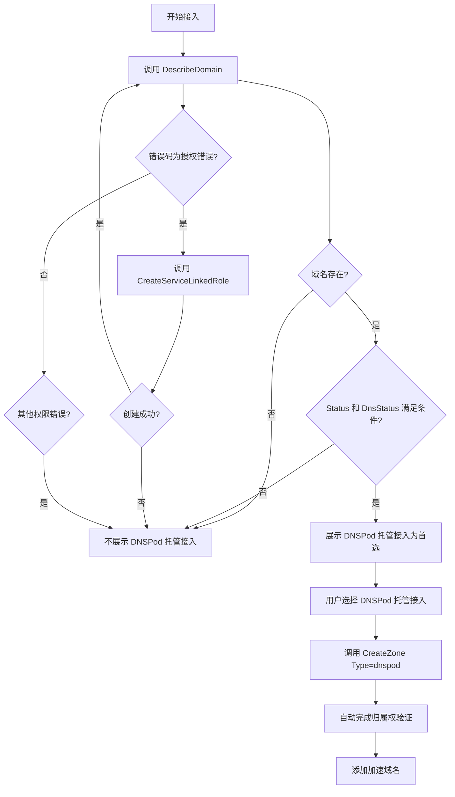

# DNSPod 集成 API 参考

EdgeOne 支持 DNSPod 托管接入模式，可以实现域名的一键接入和自动化配置。本文档说明相关 API 的调用方法。

## 查询域名托管状态

### DescribeDomain（DNSPod）

**用途**：查询域名是否在 DNSPod 托管，以及托管状态是否满足 EdgeOne 接入条件。

**调用示例**：

```bash
tccli dnspod DescribeDomain --Domain "example.com"
```

**关键响应字段**：

```json
{
  "DomainInfo": {
    "Domain": "example.com",
    "DomainId": 12345678,
    "Status": "ENABLE",        // 域名状态：ENABLE(正常)、PAUSE(暂停)、SPAM(封禁)
    "DnsStatus": "",           // DNS 状态：空字符串(正常)、"dnserror"(异常)
    "Grade": "DP_Pro",         // 套餐等级
    "DnspodNsList": [          // DNSPod 的 NS 列表
      "ns1.dnspod.net",
      "ns2.dnspod.net"
    ],
    "ActualNsList": [          // 域名实际使用的 NS
      "ns1.dnspod.net",
      "ns2.dnspod.net"
    ]
  }
}
```

**EdgeOne 接入条件判断**：

域名满足以下所有条件时，可使用 DNSPod 托管接入：

1. ✅ 域名存在（接口调用成功）
2. ✅ `Status` 字段为 `"ENABLE"` 或 `"LOCK"`
3. ✅ `DnsStatus` 字段为空字符串 `""`

**常见错误处理**：

| 错误码 | 说明 | 处理方式 |
|--------|------|----------|
| `ResourceNotFound.NoDataOfDomain` | 域名不存在于 DNSPod | 不展示 DNSPod 托管接入选项 |
| `OperationDenied.DNSPodUnauthorizedRoleOperation` | 缺少服务授权 | 尝试自动创建服务授权角色 |
| `UnauthorizedOperation` | 用户无 DNSPod 接口权限 | 不展示 DNSPod 托管接入选项 |

## 创建服务授权角色

### CreateServiceLinkedRole（CAM）

**用途**：为用户创建 EdgeOne 访问 DNSPod 的服务授权角色。

**触发场景**：调用 `DescribeDomain` 接口返回 `OperationDenied.DNSPodUnauthorizedRoleOperation` 错误时。

**调用示例**：

```bash
tccli cam CreateServiceLinkedRole \
  --QCSServiceName '["DnspodaccesEO.TEO.cloud.tencent.com"]' \
  --Description "当前角色为边缘安全加速平台(TEO)服务相关角色，该角色将在已关联策略的权限范围内查询您在DNSPod产品内已接入的域名状态以及相关解析记录，并在一键修改解析的场景下帮助您快速完成解析修改将加速服务切换至EO"
```

**响应示例**：

```json
{
  "RoleId": "4611686018428516331",
  "RequestId": "abcd1234-5678-90ef-ghij-klmnopqrstuv"
}
```

**后续操作**：

- ✅ 若创建成功：重新调用 `DescribeDomain` 检测域名状态
- ❌ 若创建失败：启用兜底模式，不展示 DNSPod 托管接入选项

## DNSPod 托管接入流程

### 完整调用流程



### 接入模式参数

在调用 `CreateZone` 时，`Type` 参数的可选值：

- `dnspod`：DNSPod 托管接入
- `full`：NS 接入
- `partial`：CNAME 接入

**推荐策略**：

1. 优先检测是否满足 DNSPod 托管接入条件
2. 若满足，将 `dnspod` 作为**首选推荐**展示给用户
3. 始终提供 `full` 和 `partial` 作为备选方案

## 最佳实践

### 1. 静默检测，智能推荐

```python
# 伪代码示例
def get_available_access_types(domain):
    access_types = []
    
    # 尝试检测 DNSPod 托管状态
    try:
        response = dnspod.DescribeDomain(Domain=domain)
        domain_info = response['DomainInfo']
        
        # 判断是否满足条件
        if (domain_info['Status'] in ['ENABLE', 'LOCK'] and 
            domain_info['DnsStatus'] == ''):
            access_types.append({
                'type': 'dnspod',
                'name': 'DNSPod 托管接入',
                'recommended': True,
                'description': '无需手动配置，自动完成验证'
            })
    
    except DNSPodUnauthorizedRoleOperation:
        # 尝试自动授权
        try:
            cam.CreateServiceLinkedRole(...)
            # 重试检测
            return get_available_access_types(domain)
        except:
            pass  # 授权失败，使用兜底方案
    
    except:
        pass  # 其他错误，使用兜底方案
    
    # 兜底：始终提供 NS 和 CNAME 接入
    access_types.extend([
        {'type': 'full', 'name': 'NS 接入'},
        {'type': 'partial', 'name': 'CNAME 接入'}
    ])
    
    return access_types
```

### 2. 用户体验优化

**向用户展示时的建议话术**：

✅ **满足 DNSPod 托管条件时**：

> 检测到您的域名 `example.com` 已在 DNSPod 托管，推荐使用 **DNSPod 托管接入**模式，可以自动完成验证和配置，无需手动操作 DNS。
> 
> 您也可以选择其他接入模式：
> - NS 接入：需要修改域名的 NS 记录
> - CNAME 接入：需要添加 TXT 记录验证归属权

❌ **不满足 DNSPod 托管条件时**：

> 请选择接入模式：
> - NS 接入：EdgeOne 完全接管 DNS 解析
> - CNAME 接入：仅配置 CNAME 记录，不改变 NS

### 3. 错误处理建议

| 场景 | 用户提示 | 技术处理 |
|------|----------|----------|
| 域名不在 DNSPod | 不提示，直接提供 NS/CNAME 选项 | 静默处理 |
| 缺少服务授权 | "正在为您配置服务授权..." | 自动调用 CreateServiceLinkedRole |
| 授权创建失败 | 不提示，直接提供 NS/CNAME 选项 | 静默回退到兜底方案 |
| 域名状态异常 | 不提示，直接提供 NS/CNAME 选项 | 静默处理 |

## 参考资料

- [DNSPod API 文档](https://cloud.tencent.com/document/product/1427)
- [CAM 服务相关角色](https://cloud.tencent.com/document/product/598/19388)
- [EdgeOne CreateZone 接口](https://cloud.tencent.com/document/product/1552/80719)
